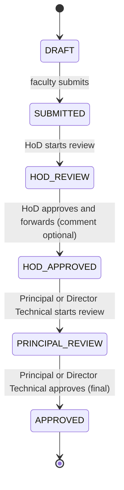

# Appraisal workflow

States and transitions are defined in `AppraisalStatus` and enforced on the backend. The UI never decides.

The approval chain is **faculty -> Head of the Department -> Principal or Director Technical**. A faculty member submits to
the HoD of their department. The HoD begins the review, may write a comment, and approves, which forwards the appraisal to
the Principal and the Director Technical. They stand at the same level (see below): either one's approval is final.
**Nothing moves backwards:** there is no return or revert step, so a submitted appraisal can no longer be edited by anyone.

## Who can do what

| Action | Role | From state | Notes |
|---|---|---|---|
| Create | Faculty | none | One per academic year |
| Submit | Owner | DRAFT | Needs the accepted declaration (the form's Declaration; the date is recorded by the server) and the essentials: Part A contact number, qualification and specialization and joining date, at least eight courses handled (4 in each of the year's 2 semesters; 2.5 marks each towards the workload component), and a self-score for every criterion that applies to the cadre. The API refuses with 400 and says what is missing, and the appraisal view lists it as `submitBlockers`. Everything else may be empty |
| Start / Approve | Assigned HoD | SUBMITTED / HOD_REVIEW | The comment (max 2000 chars) is optional and is printed as "Recommendations of HoD"; approving forwards to the Principal or the Director Technical |
| Start / Approve | Principal | HOD_APPROVED / PRINCIPAL_REVIEW | Whole college; comment optional ("Remarks of the Principal"); approve is final |
| Start / Approve | Director Technical | HOD_APPROVED / PRINCIPAL_REVIEW | The same as the Principal: whole college; comment optional ("Remarks of the Director Technical"); approve is final |

| Message | Assigned HoD | HOD_REVIEW | A note to the faculty member (max 2000 chars), for example to ask them to come and discuss a query before it can be approved. It does not change the workflow status: it stays `HOD_REVIEW` and the appraisal stays locked. What changes is how it is shown: from the first message until the HoD approves, the appraisal is shown as **Query raised** (`queryRaised` on the appraisal, its list entries and the HoD console's roster) instead of "With HoD", the HoD's lists move it from "Needs your action" to "Awaiting the faculty member", and the faculty member is told to arrange a meeting. The message also counts as activity on the appraisal (its "last updated" time moves). The HoD who wrote it may edit it (`PUT .../messages/{messageId}`) while the status is `HOD_REVIEW`; the faculty member then sees it marked edited and unread again. Each replaced wording is kept (append-only) and is shown to the department's HoDs, not to the faculty member. It cannot be deleted. The faculty member sees it on their dashboard and on the Score & Review page; it is marked seen when they open it, and the HoD sees that. Only the owner and the assigned HoD can read it |

There is no other step that moves an appraisal. `POST /api/appraisals/{id}/review/return` does not exist (404), and neither
do the Dean and Vice Principal areas. A message is not a return. Any of several HoDs assigned to a department may act; if two start at once exactly one wins and the
other gets 409.

The comments reviewers write with an approval are **not shown to the faculty member**: the API removes them from the review
history the faculty member receives, and the PDF the faculty member downloads leaves them out (the official copy stored at
approval has them). A message from the HoD is the one thing in words the faculty member is shown during the review.

## Visibility

| Viewer | Can open an appraisal when |
|---|---|
| Faculty | it is their own |
| HoD | it is in their assigned department and **not a draft** |
| Principal, Director Technical | the HoD has approved it (HOD_APPROVED, PRINCIPAL_REVIEW or APPROVED) |
| Admin | never (configuration role only) |

Anything not visible returns **404**, so existence is not leaked. The consoles apply the same rules to what they count
(`docs/requirements.md`).

## The Director Technical

The Director Technical (`DIRECTOR`, migration V23) stands at the Principal's level. No status was added; the two share
`HOD_APPROVED` and `PRINCIPAL_REVIEW`:

- Either one may begin the review of an appraisal the HoD has forwarded, and either may give the approval, whichever of
  them began it. Once one has begun, the other cannot begin again (409); the status is what decides, not who acted first.
- Each has their own steps (`START_DIRECTOR_REVIEW`, `DIRECTOR_APPROVE` beside `START_PRINCIPAL_REVIEW`,
  `PRINCIPAL_APPROVE`), so the review history, the audit trail and the report say which of them acted.
- Their console (`/director`, `GET /api/director/console`) is the Principal's console, with the same college-wide figures.
  Each console is open to its own role only: the Principal gets 403 on the Director's and the Director on the Principal's.
- The printed report has a box for each: **Remarks of the Principal** and **Remarks of the Director Technical**. Both are
  always printed. The one that did not act on that appraisal is left empty, to be signed on paper if the college wishes.
  Official reports issued before V23 are stored as they were and do not gain the box.
- The administrator's set-up check asks for one active Principal **or** Director Technical account.

## Integrity

- A transition is `UPDATE ... WHERE id = ? AND status = ?`. If two requests race, exactly one wins and the other gets
  409. This is covered by concurrency tests (8 simultaneous submits; two HoDs starting at once).
- Every transition writes a `review_actions` row and an `audit_logs` row in the same transaction.
- `review_actions` is append-only (database triggers reject UPDATE and DELETE). `audit_logs` cannot be edited, but an administrator may delete entries; each deletion is recorded (see `docs/security.md`).
- The database also refuses `APPROVED` without an approval timestamp, and the reverse; `appraisals.status` and
  `users.role` are CHECK-constrained to the values of this chain.

## The earlier, longer chain

Until migration V8 the chain was faculty -> HoD -> Dean -> Vice Principal -> Principal, and every reviewer could return
an appraisal to the faculty member. That was withdrawn. What happened under it is kept, not rewritten:

- `review_actions` and `audit_logs` still name the old steps, statuses and roles exactly as they happened, and the
  screens and the report can still read them (an older appraisal's history shows "Dean recommended it", and its report
  keeps the Dean's and Vice Principal's remarks).
- An appraisal that stood at a withdrawn status was moved once, with an audit entry (`APPRAISAL_STATUS_MIGRATED`):
  returned to its author -> `DRAFT` (it was open for correction; it is submitted again); with, or passed by, the Dean
  or the Vice Principal -> `HOD_APPROVED` (it now waits for the Principal).
- Dean and Vice Principal accounts were closed (`USER_ROLE_WITHDRAWN` in the audit trail). They keep their role for
  the record, cannot sign in, and cannot be re-opened: the database allows those two roles only on a disabled account,
  and the administrator's screens refuse to change one. `dean_assignments` is left in place, unused.
